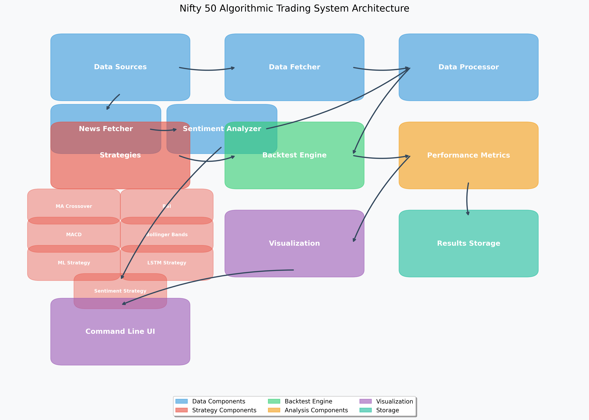

# Nifty 50 Algorithmic Trading System Architecture

## System Overview

The Nifty 50 Algorithmic Trading System is designed to implement and backtest various trading strategies on the Indian market, specifically the Nifty 50 index. The system follows a modular architecture that separates data processing, strategy implementation, backtesting, and results analysis.

## Component Descriptions

### Data Components

#### Data Sources
- External market data providers (nsepy, investpy, yfinance)
- Historical price data for Nifty 50
- Optional: Alternative data sources

#### Data Fetcher
- Retrieves market data from various sources
- Handles API communication and data retrieval
- Provides fallback mechanisms when primary sources fail
- Located in `src/utils/data_fetcher.py` and `src/utils/nifty_data_fetcher.py`

#### Data Processor
- Cleans and prepares data for analysis
- Handles missing values and data normalization
- Calculates derived features needed by strategies
- Located in `src/utils/data_processor.py`

### Strategy Components

The system implements several trading strategies:

#### Moving Average Crossover
- Uses crossovers between short and long-term moving averages
- Generates buy/sell signals based on price movement trends
- Located in `src/strategies/moving_average_crossover.py`

#### RSI Strategy
- Uses Relative Strength Index to identify overbought/oversold conditions
- Generates signals based on RSI crossing threshold values
- Located in `src/strategies/rsi_strategy.py`

#### MACD Strategy
- Uses Moving Average Convergence Divergence indicator
- Identifies momentum changes and potential trend reversals
- Located in `src/strategies/macd_strategy.py`

#### Bollinger Bands
- Uses price volatility bands to identify market conditions
- Generates signals when price moves outside bands
- Located in `src/strategies/bollinger_bands.py`

#### ML Strategy
- Uses machine learning models to predict price movements
- Trains on historical data with various features
- Located in `src/strategies/ml_strategy.py`

#### LSTM Strategy
- Uses deep learning (Long Short-Term Memory networks)
- Designed to capture complex temporal patterns in time series data
- Located in `src/strategies/lstm_strategy.py`

### Backtest Engine

- Core component that simulates trading over historical data
- Processes buy/sell signals from strategies
- Tracks portfolio performance and trade execution
- Calculates transaction costs and slippage
- Located in `src/backtest/backtest_engine.py`

### Analysis Components

#### Performance Metrics
- Calculates key performance indicators:
  - Total return
  - Sharpe ratio
  - Maximum drawdown
  - Win/loss ratio
  - Risk-adjusted returns
- Located in `src/utils/performance_metrics.py`

#### Visualization
- Generates charts and plots for strategy performance
- Creates comparison visualizations between strategies
- Plots key indicators alongside price data
- Located in `src/visualization/compare_strategies.py`

#### Results Storage
- Saves backtest results and performance metrics
- Exports data to CSV files for further analysis
- Organizes results by strategy and time period
- Stored in `results/nifty50/`

### Command Line UI
- Provides a user interface to run backtests
- Handles command line arguments and configuration
- Entry points via `nifty_backtest.py` and `run_nifty.py`

## Data Flow

1. Data Acquisition: External market data is fetched via the Data Fetcher
2. Data Processing: Raw data is cleaned and prepared by the Data Processor
3. Strategy Execution: Trading strategies analyze the processed data and generate signals
4. Backtesting: The Backtest Engine simulates trades based on strategy signals
5. Performance Analysis: Results are analyzed and performance metrics are calculated
6. Visualization: Results are visualized through charts and graphs
7. Results Storage: Performance data is saved for future reference

## System Configuration

The system's behavior can be configured through:
- Command line arguments in `nifty_backtest.py` and `run_nifty.py`
- Configuration files in the `config/` directory
- Strategy-specific parameters in each strategy implementation

## Extension Points

The system is designed to be extended in several ways:
1. Adding new data sources in the Data Fetcher
2. Implementing new trading strategies by extending the base strategy class
3. Adding new performance metrics in the Performance Metrics component
4. Creating new visualization types in the Visualization component

## Key Files and Directories

- `src/utils/`: Core utilities for data handling and analysis
- `src/strategies/`: Trading strategy implementations
- `src/backtest/`: Backtesting engine and framework
- `src/visualization/`: Visualization utilities
- `data/`: Storage for historical market data
- `results/`: Storage for backtest results and visualizations
- `config/`: Configuration files
- `nifty_backtest.py`: Main command-line interface
- `run_nifty.py`: Legacy command-line interface 