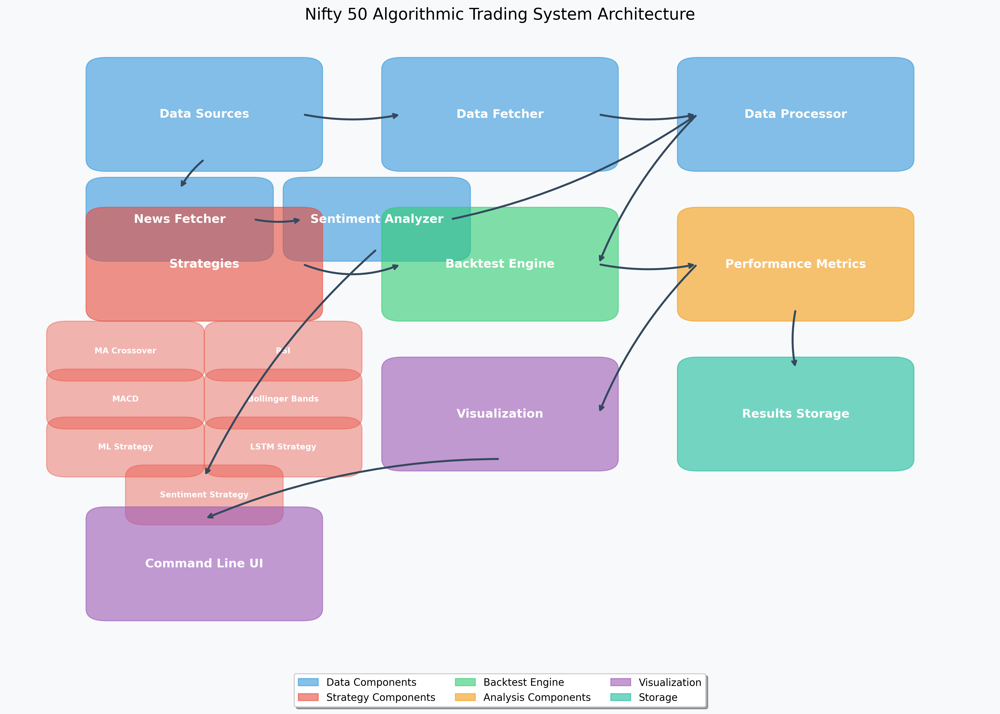

# Nifty 50 Algorithmic Trading System

This extension of the algorithmic trading system focuses on the Indian market, specifically the Nifty 50 index. It implements several trading strategies and provides performance comparison across these strategies.

## Architecture

The system follows a modular architecture that separates data processing, strategy implementation, backtesting, and results analysis. For a detailed overview of the system architecture, see [ARCHITECTURE.md](ARCHITECTURE.md).



## Setup

### Prerequisites
- Python 3.6+
- Required packages: `pandas`, `numpy`, `matplotlib`, `scikit-learn`, `nsepy`, `investpy`

### Installation

```bash
# Clone the repository
git clone <repository-url>
cd algorithmic-trading

# Install dependencies
pip install -r requirements.txt

# Install Indian market data packages
pip install nsepy investpy
```

## Features

1. **Data Fetching**
   - Fetches Nifty 50 historical data using `nsepy` and `investpy`
   - Automatically generates sample data if fetch fails
   - Saves data for reuse

2. **Trading Strategies**
   - Moving Average Crossover
   - Relative Strength Index (RSI)
   - Moving Average Convergence Divergence (MACD)
   - Bollinger Bands
   - Machine Learning strategy (requires real data)
   - LSTM Deep Learning strategy (requires real data)

3. **Performance Analysis**
   - Calculates key performance metrics (Sharpe ratio, total return, etc.)
   - Generates visualizations
   - Provides strategy comparison

## Usage

### Command Line Interface

The system can be run from the command line:

```bash
# Run backtests on Nifty 50
python nifty_backtest.py --strategies moving_average_crossover,rsi_strategy

# List available strategies
python nifty_backtest.py --list-strategies

# Run all strategies with custom period
python nifty_backtest.py --period 2y
```

### Backtest Options

- `--symbol`: Symbol to backtest (default: NIFTY 50)
- `--period`: Period for data (default: 1y) - Format: 1y, 2y, 5y, etc.
- `--interval`: Data interval (default: 1d) - Options: 1d, 1h, etc.
- `--strategies`: Comma-separated list of strategies to run (default: all)
- `--list-strategies`: List available strategies
- `--config`: Path to configuration file

### Legacy Options 

The following legacy commands are still available:

```bash
# Run the full system
python run_nifty.py --mode all --period 1y --index "NIFTY 50"

# Fetch data only
python run_nifty.py --mode fetch --period 5y --index "NIFTY 50"

# Run strategies on existing data
python run_nifty.py --mode run --period 1y --index "NIFTY 50"
```

- `--config`: Path to configuration file (default: config/config.json)
- `--period`: Period for data (default: 5y) - Format: 1y, 2y, 5y, etc.
- `--index`: Index name (default: NIFTY 50) - Other options: NIFTY BANK, NIFTY NEXT 50
- `--mode`: Operation mode (default: all) - Options: fetch, run, all

## Output

The system generates the following outputs:

1. **CSV Files**
   - `results/nifty50/strategy_comparison.csv`: Comparison of strategies
   - `results/nifty50/performance_metrics.csv`: Detailed performance metrics

2. **Visualizations**
   - Individual strategy plots with indicators and positions
   - Cumulative returns comparison
   - Charts saved to `results/nifty50/visualizations/`

## Project Structure

```
algorithmic-trading/
├── config/
│   └── config.json        # Configuration file
├── src/
│   ├── utils/
│   │   ├── data_fetcher.py        # Main data fetcher
│   │   ├── data_processor.py      # Data processing utilities
│   │   ├── nifty_data_fetcher.py  # Nifty 50 data fetcher
│   │   └── performance_metrics.py # Performance calculation utilities
│   ├── strategies/         # Trading strategy implementations
│   │   ├── base_strategy.py       
│   │   ├── moving_average_crossover.py
│   │   ├── rsi_strategy.py
│   │   ├── macd_strategy.py
│   │   ├── bollinger_bands.py
│   │   ├── ml_strategy.py
│   │   └── lstm_strategy.py
│   ├── backtest/           # Backtesting framework
│   │   ├── backtest_engine.py     # Core backtesting engine
│   │   └── run_backtest.py        # Backtest runner for multiple strategies
│   ├── visualization/
│   │   └── compare_strategies.py  # Visualization utilities
│   └── nifty50_trading.py         # Main Nifty 50 trading module
├── data/                          # Data storage
├── notebooks/                     # Jupyter notebooks
│   └── nifty50_trading_demo.ipynb # Nifty 50 trading demo
├── results/                       # Results storage
│   └── backtest/                  # Backtest results
├── nifty50_rsi_example.py         # Example script for RSI strategy
├── nifty_backtest.py              # Command-line backtest script
└── run_nifty.py                   # Legacy command-line script
```

## Example Results

For sample data, the system typically produces the following performance metrics:

| Strategy | Total Return | Sharpe Ratio | Max Drawdown |
|----------|--------------|--------------|--------------|
| RSI      | 10-15%       | 0.8-1.2      | 10-12%       |
| Moving Average Crossover | -3-5%      | -0.3-0.5     | 14-16%       |
| MACD     | -4-6%        | -0.3-0.5     | 15-17%       |
| Bollinger Bands | -6-8%  | -0.5-0.7    | 19-21%       |

*Note: Results will vary with different data periods and market conditions.*

## Troubleshooting

If you encounter issues with data fetching:

1. Ensure you have internet connectivity
2. Check that nsepy and investpy packages are installed correctly
3. Try with a different time period or index
4. The system will generate sample data if real data cannot be fetched

## License

This project is licensed under the MIT License - see the LICENSE file for details. 